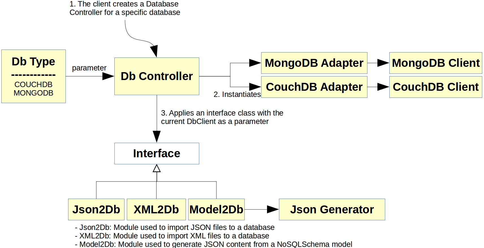

# NoSQLDataEngineering

This repository stores the last versions of all the projects available to infer a schema from an Aggregate-oriented NoSQL database. It uses a model-driven engineering approach based on Eclipse Modeling Framework. It also contains several utility projects used to visualize, classify and generate code from a NoSQL schema model.

A NoSQL schema is a schema used to define which data and in which format is being stored in a NoSQL database. This schema is not explicitly defined but inferred by a data-oriented infererence process.

# Table of contents

- [Inference process](#inference-process)
- [NoSQLSchema metamodel](#nosql-schema-metamodel)
- [Database import](#database-import)
- [NoSQL import](#nosql-import)
- [Json to DBSchema](#json-to-dbschema)
***
- [NoSQL Schema visualization](#nosql-schema-visualization)
- [Data visualization](#data-visualization)
***
- [Entity differentiation](#entity-differentiation)
- [Decision tree](#decision-tree)
***
- [DSL4Mongoose](#dsl-for-mongoose)
- [DSLParameter](#dsl-parameter)
- [PlantUML](#plantuml)
***

# Inference process

The inference process assumes the following initial scenario:

* An aggregate-oriented NoSQL database is running. At the moment supported databases are **MongoDB** and **CouchDB**. A database must be running, containing some information

***

# NoSQL Schema metamodel

The projects involved in the NoSQL Schema metamodel definition are the following ones:

* `es.um.nosql.schemainference`: This projects stores the metamodel definition in an ecore file, stored in model/nosqlschema.ecore. It also contains the generated java classes for this metamodel, as well as some utilities such as a **Model loader** used to load model definitions in a XMI file.
* `es.um.nosql.schemainference.edit` and `es.um.nosql.schemainference.editor`: These projects are used to define a generated editor in order to manipulate NoSQL schema models with the Ecore interface.

The most important elements of this projects are, apart from the metamodel definition, the Model loader, which will be used in several other projects to start some processes from a model file located somewhere in the file system. It also contains a PrettyPrinter class which can take a NoSQL schema model and print it to the standard input in a human-readable way.

## The NoSQL schema metamodel

<figure>
    
</figure>
<br/>

* The NoSQLSchema metamodel has **NoSQLSchema** as a root element with a certain name and containing several Entities.
* An **Entity** describes an object of the real world such as _Movie_, _Prize_, _Director_ or _Criticism_. It contains, at the same time, several version definitions.
* An **EntityVersion** is a certain version of an _Entity_, with an _identifier_, a _count_ attribute (indicating how many objects in the bd correspond to this version) and a boolean _root_ attribute, indicating if this version is a root element or is embedded into some other object. An **EntityVersion** may contain several properties.
* An **Attribute** is a kind of **Property** with a _name_ and an associated _type_. This _type_ may be at the same time a **Primitive type** such as a _String_, _Number_ or _Boolean_, or a _Tuple_ containing several _Tuples_ and _Primitive types_ inside of it.
* A **Reference** is a kind of **Property** with a cardinality, a _name_ and is associated with an _Entity_. This way an object inside a database may be associated with another object by pointing to its _id_ on this field.
* An **Aggregate** is a kind of **Property** with a cardinality, a _name_ and potentially several associated _EntityVersions_. This way an object may embed several other objects inside of it.

<figure>
    
</figure>
<br/>

In the image above there is an example of a NoSQLSchema model based on a 'Movies' domain. It is divided into several parts:

* Entity _Movie_: With three **EntityVersions**, each one of them containing several **Attributes**, **References** and **Aggregates**. Some of these _references_ are associated with _Director_, and some _aggregations_ embed other entity versions such as _Criticism_.
* Entity _Director_: Divided in two versions with references to _Movie_.
* Entity _Criticism_: Divided in two versions with several simple **Attributes** of **Primitive Type**.
* Entity _Rating_: With just one entity version and a couple of string **Attributes**.
* Entity _Prize_: With another entity version, and a couple **Attributes**, being one of them a **Tuple**.

A NoSQLSchema model may be obtained by aplying the inference process described [here](#inference-process). Once a NoSQLSchema model is obtained, it may be used for several things:

* It can be visualized by using the NoSQL Schema visualization tool ([link](#nosql-schema-visualization))
* It can be used to generate a differentiation model used to classify objects and visualize them in D3.js ([link](#data-visualization))
* It can be used to generate a Decision tree to effectively classify objects of this database. Projects related are 'Entity Differentiation'([link](#entity-differentiation)) and 'Decision tree'([link](#decision-tree))
* ...

***

# Database import

This project is used to fill a database with raw data from a file. It may be not necessary if the input for the inference process is an already filled database, but in some cases the user will have just a JSON, XML or CSV file, and so this project might come handy to import the relevant files into a database.

As an example of the usage the user may check the **Main** class. The process goes as follow:

* A **DbController** object is created with a certain **DbType** as a parameter. This way the controller will create a client for the specified database.
* An input method is selected by calling to a certain method of the **DbController**: __model2Db__, __xml2Db__ or __json2Db__ methods are given as examples.
  - The __model2Db__ method expects a NoSQLSchema model and then it will generate random JSON information according to the given model. Then it will proceed to insert the JSON data on the database. More details may be checked on the **Model2Db** and **JsonGenerator** classes.
  - The __xml2Db__ method makes use of the **XML2Db** class and expects a XML file with the following format:
    ```
    <?xml version="1.0" encoding="utf-8"?>
    <collectionName>
        <row <parameter 1>=<value 1> <parameter 2>=<value 2> ... ... <parameter N>=<value N>/>
        <row <parameter 1>=<value 1> <parameter 2>=<value 2> ... ... <parameter N>=<value N>/>
        <row <parameter 1>=<value 1> <parameter 2>=<value 2> ... ... <parameter N>=<value N>/>
    </collectionName>
    ```
  - The __json2Db__ method makes use of the **Json2Db** class and expects a route to a JSON file as well as a database name. It will insert the content found into the database with an appropiate collection name.
  - The user will probably need to create its own interface class if the implemented ones are not enough for its requirements, but the implementation shouldn't be too difficult.
* Now the controller will apply the input method with the given client, filling the database.

<figure>
    
</figure>
<br/>

The Java project involved in the __Database import__ project is the following one:

* `es.um.nosql.schemainference.db`: This project contains a definition of a database controller able to fill **MongoDB** and **CouchDB** databases given a certain XML, JSON or model file. It is also possible to implement classes to process data files into the database, if needed.

***

# NoSQL import

This project is aimed to import JSON data from a NoSQL database. It is provided with a MapReduce process and applies this process to the given database. As a result of the MapReduce process it obtains a subset of representative database objects which describes all the entities and versions found on that database. It supports **MongoDB** and **CouchDB** databases, but this list will be updated on the near future with more document based databases. As an input for this project to work the user needs to provide the following inputs:

* A fully working **MongoDB** or **CouchDB** database with some data on it.
* A database name to which the process will infer representative JSON objects and apply the MapReduce process.
* A MapReduce folder containing a **map.js** file and a **reduce.js** file. These files contain JavaScript code, they may be found on the corresponding folder and are not likely to change.

<figure>
    
</figure>
<br/>

An example of its usage is just based on the creation of a __MongoDB/CouchDBImport__ object and an execution of a suitable method. The process goes as follow:

* A **MongoDB/CouchDBImport** object is created and there are a couple of **map.js** and **reduce.js** on a folder.
* The created object will apply the **MapReduce** files to a given database and extract a minimum representation of the Json objects stored on the database.
* The object now will apply an homogeneization to to each object in order to remove unnecessary attributes (such as __rev_, __id_, etc).
* The object will finally apply the desired output format and return the result to the client.

The Java project involved in the __NoSQL import__ project is the following one:

* `es.um.nosql.schemainference.nosqlimport`: This project contains a definition of two database importers able to interact with **MongoDB** and **CouchDB**. It also contains some helper classes in order to return a suitable output as a _Stream\<JsonObject\>_, _JsonArray_ or a Json file which will be used on the schema extraction process (see [here](#json-to-dbschema)). As more databases are supported new classes will be added to this project.

***

# Json to DBSchema

***

# NoSQL Schema visualization

This tool is designed to represent schemas and schema versions in a friendly way using Sirius (https://eclipse.org/sirius/). Sirius is a modeling tool used to generate graphical DSLs in an easy way, but also to define a suitable representation for a given model. As a result of the inference process described above ([link](#inference-process)) a NoSQLSchema model is given, and that model is the input for the visualization process.

At the moment there are defined the following viewpoints:

* A _tree viewpoint_ in which all schema versions are listed as well as the entity versions (ordered alphabetically). This tree representation is divided into three branches, each one of them showing a certain aspect: A **Schema**branch in which _schema versions_ are shown ordered by the **Entity** to which its root **EntityVersion** belongs, an **Inverted Index** in which all the **EntityVersions** are listed as well as the _schema versions_ in which they are involved, and finally a **Dictionary** branch in which each **Entity** is displayed with its **EntityVersions** and **Properties**.

<figure>
    
</figure>
<br/>

* A _global schema diagram representation_ to visualize the **Entities**, **EntityVersions** and **Properties**. Each one of the elements shows a defined style. This diagram shows, in a friendly way, the same information as the last branch of the _tree viewpoint_.

<figure>
    
</figure>
<br/>

* Two diagram representations associated with each _schema version_.

* A diagram representation associated to each **Entity**, as well as each element associated, in some way, with the **EntityVersions** of that **Entity**.

<figure>
    
</figure>
<br/>

The projects involved in this visualization tool are the following ones:

* `es.um.nosql.schemainference.design`: The Sirius workbench project in which the viewpoints are defined.
* `es.um.nosql.schemainference.visualization.sdk`: The feature project in which the Sirius visualization plugin is stored.

**However**: Please keep in mind this section was developed in 2016 for a M.Sc.Thesis (found [here](https://github.com/Soltari/NoSQLVisualizationTools/)) and since then several changes have been performed on the inference process. Because of that we have been wanting to redefine all the viewpoints available, since we now think the available viewpoints are not fully efficient on showing the information we want. For example, the viewpoints do not satisfy us when we use as an input really big models (hundreds of **EntityVersions**). That's why we will be redefining the implemented viewpoints and you should expect drastic changes on the viewpoints available soon(**tm**). 

***

# Data visualization

<figure>
    
</figure>
<br/>

<a href="https://www.youtube.com/watch?v=933V5AiwAgM"></a>

https://www.youtube.com/watch?v=933V5AiwAgM

This visualization tool is designed to draw different graphics representing the data classification of a NoSQL database using D3.js (https://d3js.org/). D3.js is a JavaScript library for manipulating documents based on data. As a result of the inference process described above ([link](#inference-process)) a NoSQL\_Schema model is given, and HTML5/CSS3/JavaScript code is generated as an output of the visualization process.

Once the code is generated the user just needs to provide a JSON file with the database objects, and make sure that these objects have a defined id field of some kind as well as a "type" attribute indicating its type (the entity it belongs to).

<figure>
    
</figure>
<br/>

The NoSQL\_Schema model will then be transformed by a m2m transformation into a Version\_Diff model which defines, for each version entity (and each JSON object) a collection of HasField and HasNotField defining how the version is composed, by which properties and with which types. Now a m2t transformation can be executed which in the end will generate JavaScript.

<figure>
    
</figure>
<br/>

Once the m2t transformation is finished a HTML5/JS project is created with an index.html. Giving a proper JSON object collection file it is possible to classify this collection into its entities and versions and represent the results with D3.js graphics.

<figure>
    
</figure>
<br/>

<figure>
    
</figure>
<br/>

The project involved in this visualization tool is the following one:

* `es.um.nosql.schemainference.datavisualization`: Project with the Version\_Diff metamodel definition. It also contains all the m2m and m2t transformations, and references the NoSQLSchema project.

Also in the NoSQLDataIndex project several examples can be found. Each example is contained in a folder with the JavaScript code already generated. To visualize each example, just open the index.html file in a web browser.

**Please** keep in mind this section was developed in 2016 for a M.Sc.Thesis (found [here](https://github.com/Soltari/NoSQLVisualizationTools/)), and so it will become obsolete and need some refinements at some point.

***

# Entity differentiation

***

# Decision tree

***

# DSL for Mongoose

***

# DSL Parameter

***

# PlantUML

***