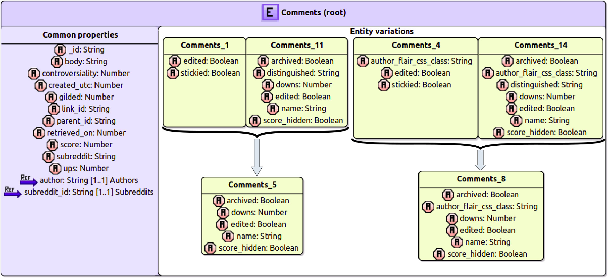

# NoSQLDataEngineering

This repository stores the last versions of all the projects available to infer a schema from an Aggregate-oriented NoSQL database. It uses a model-driven engineering approach based on Eclipse Modeling Framework. It also contains several utility projects used to visualize, classify and generate code from a NoSQL schema model.

A NoSQL schema is a schema used to define which data and in which format is being stored in a NoSQL database. This schema is not explicitly defined but inferred by a data-oriented infererence process.

# Table of contents

- [The Athena Language](#the-athena-language)
- [The Orion Language](#the-orion-language)
***
- [Schema models](#schema-models)
- [Inference process](#inference-process)
- [NoSQLSchema metamodel](#nosql-schema-metamodel)
- [NoSQL import](#nosql-import)
- [Json to DBSchema](#json-to-dbschema)
***
- [Database import](#database-import)
- [Random data generation](#random-data-generation)
***
- [Subtype discovery](#subtype-discovery)
- [Schema evolution](#schema-evolution)
***
- [Object Document mappers](#object-document-mappers)
***
- [NoSQL Schema visualization](#nosql-schema-visualization)
- [Data visualization](#data-visualization)
***
- [Decision tree](#decision-tree)
***

# The Athena language

For an extended reference of the Athena language please visit <https://catedrasaes-umu.github.io/NoSQLDataEngineering/tools.html>

# The Orion language

For an extended reference of the Orion language please visit <https://catedrasaes-umu.github.io/NoSQLDataEngineering/tools.html>

# Schema models

Projects:   es.um.nosql.examples, es.um.nosql.orchestrator.test
TODO...

# Inference process

The inference process assumes the following initial scenario:

* A document-based NoSQL database is running. At the moment supported databases are **MongoDB** and **CouchDB**. If this requirement is not met or your data is in another format, maybe [this](#database-import) will help you.
* The database must be divided into several tables or collections or each object must contain a _type_ attribute indicating its collection. Each object must also contain a unique __id_ attribute.
* The user has installed the **Eclipse Modeling Framework** (EMF, http://www.eclipse.org/modeling/emf/)

The following projects are needed to execute the inference process:
* [NoSQL Schema metamodel](#nosql-schema-metamodel): `es.um.nosql.s13e`, `es.um.nosql.s13e.edit` and `es.um.nosql.s13e.editor`.
* [NoSQL import](#nosql-import): `es.um.nosql.s13e.nosqlimport`.
* [Json to DBSchema](#json-to-dbschema): `es.um.nosql.s13e.json2dbschema`.

Some examples of the inference process may be found on the `es.um.nosql.orchestrator.test` project. The process is resumed as follows:
* First of all the **NoSQL import** project is used and a database importer is created. Then a convenient method is used to infer from the database a minimum set of objects describing the existing versions:
    ```
    System.out.println("Starting inference...");
    MongoDBImport inferrer = new MongoDBImport();
    JsonArray jArray = inferrer.mapRed2Array(MONGODB_IP, TABLENAME, MONGODB_MAPREDUCE_FOLDER);
    System.out.println("Inference finished.");
    ```
* Then the **Json2DBSchema** project is used, and the result of the last step is supplied as an input. In our case we will commonly use a JsonArray with the minimum objects from the last step as an input:
    ```
    System.out.println("Starting BuildNoSQLSchema...");
    BuildNoSQLSchema builder = new BuildNoSQLSchema();
    builder.buildFromGsonArray(TABLENAME, jArray, OUTPUT_MODEL_NAME);
    ```
* The result of the inference process will be a NoSQLSchema saved in the _OUTPUT\_MODEL\_NAME_ route.
* Now this model may be visualized or used to generate some code using any other project from this repository.

***

# NoSQL Schema metamodel

The projects involved in the NoSQL Schema metamodel definition are the following ones:

* `es.um.nosql.s13e`: This projects stores the metamodel definition in an ecore file, stored in model/nosqlschema.ecore. It also contains the generated java classes for this metamodel, as well as some utilities such as a **Model loader** used to load model definitions in a XMI file.
* `es.um.nosql.s13e.edit` and `es.um.nosql.s13e.editor`: These projects are used to define a generated editor in order to manipulate NoSQL schema models with the Ecore interface.

The most important elements of this projects are, apart from the metamodel definition, the Model loader, which will be used in several other projects to start some processes from a model file located somewhere in the file system. It also contains a PrettyPrinter class which can take a NoSQL schema model and print it to the standard input in a human-readable way.

## The NoSQL schema metamodel

<figure>
    
</figure>
<br/>

* The NoSQLSchema metamodel has **NoSQLSchema** as a root element with a certain name and containing several Entities.
* An **Entity** describes an object of the real world such as _Movie_, _Prize_, _Director_ or _Criticism_. It contains, at the same time, several version definitions.
* An **EntityVersion** is a certain version of an _Entity_, with an _identifier_, a _count_ attribute (indicating how many objects in the bd correspond to this version) and a boolean _root_ attribute, indicating if this version is a root element or is embedded into some other object. An **EntityVersion** may contain several properties.
* An **Attribute** is a kind of **Property** with a _name_ and an associated _type_. This _type_ may be at the same time a **Primitive type** such as a _String_, _Number_ or _Boolean_, or a _Tuple_ containing several _Tuples_ and _Primitive types_ inside of it.
* A **Reference** is a kind of **Property** with a cardinality, a _name_ and is associated with an _Entity_. This way an object inside a database may be associated with another object by pointing to its _id_ on this field.
* An **Aggregate** is a kind of **Property** with a cardinality, a _name_ and potentially several associated _EntityVersions_. This way an object may embed several other objects inside of it.

<figure>
    
</figure>
<br/>

In the image above there is an example of a NoSQLSchema model based on a 'Movies' domain. It is divided into several parts:

* Entity _Movie_: With three **EntityVersions**, each one of them containing several **Attributes**, **References** and **Aggregates**. Some of these _references_ are associated with _Director_, and some _aggregations_ embed other entity versions such as _Criticism_.
* Entity _Director_: Divided in two versions with references to _Movie_.
* Entity _Criticism_: Divided in two versions with several simple **Attributes** of **Primitive Type**.
* Entity _Rating_: With just one entity version and a couple of string **Attributes**.
* Entity _Prize_: With another entity version, and a couple **Attributes**, being one of them a **Tuple**.

A NoSQLSchema model may be obtained by aplying the inference process described [here](#inference-process). Once a NoSQLSchema model is obtained, it may be used for several things:

* It can be visualized by using the NoSQL Schema visualization tool ([link](#nosql-schema-visualization))
* It can be used to generate a differentiation model used to classify objects and visualize them in D3.js ([link](#data-visualization))
* It can be used to generate a Decision tree to effectively classify objects of this database. Projects related are 'Entity Differentiation'([link](#entity-differentiation)) and 'Decision tree'([link](#decision-tree))
* ...

***

# NoSQL import

This project is aimed to import JSON data from a NoSQL database. It is provided with a MapReduce process and applies this process to the given database. As a result of the MapReduce process it obtains a subset of representative database objects which describes all the entities and versions found on that database. It supports **MongoDB** and **CouchDB** databases, but this list will be updated on the near future with more document based databases. As an input for this project to work the user needs to provide the following inputs:

* A fully working **MongoDB** or **CouchDB** database with some data on it.
* A database name to which the process will infer representative JSON objects and apply the MapReduce process.
* A MapReduce folder containing a **map.js** file and a **reduce.js** file. These files contain JavaScript code, they may be found on the corresponding folder and are not likely to change.

<figure>
    
</figure>
<br/>

An example of its usage is just based on the creation of a __MongoDB/CouchDBImport__ object and an execution of a suitable method. The process goes as follow:

* A **MongoDB/CouchDBImport** object is created and there are a couple of **map.js** and **reduce.js** on a folder.
* The created object will apply the **MapReduce** files to a given database and extract a minimum representation of the Json objects stored on the database.
* The object now will apply an homogeneization to to each object in order to remove unnecessary attributes (such as __rev_, __id_, etc).
* The object will finally apply the desired output format and return the result to the client.

The Java project involved in the __NoSQL import__ project is the following one:

* `es.um.nosql.s13e.nosqlimport`: This project contains a definition of two database importers able to interact with **MongoDB** and **CouchDB**. It also contains some helper classes in order to return a suitable output as a _Stream\<JsonObject\>_, _JsonArray_ or a Json file which will be used on the schema extraction process (see [here](#json-to-dbschema)). As more databases are supported new classes will be added to this project.

***

# Json to DBSchema

TODO:

***

# Database import

This project is used to fill a database with raw data from a file. It may be not necessary if the input for the inference process is an already filled database, but in some cases the user will have just a JSON, XML or CSV file, and so this project might come handy to import the relevant files into a database.

As an example of the usage the user may check the **Main** class. The process goes as follow:

* A **DbController** object is created with a certain **DbType** as a parameter. This way the controller will create a client for the specified database.
* An input method is selected by calling to a certain method of the **DbController**: __model2Db__, __xml2Db__ or __json2Db__ methods are given as examples.
  - The __model2Db__ method expects a NoSQLSchema model and then it will generate random JSON information according to the given model. Then it will proceed to insert the JSON data on the database. More details may be checked on the **Model2Db** and **JsonGenerator** classes.
  - The __xml2Db__ method makes use of the **XML2Db** class and expects a XML file with the following format:
    ```
    <?xml version="1.0" encoding="utf-8"?>
    <collectionName>
        <row <parameter 1>=<value 1> <parameter 2>=<value 2> ... ... <parameter N>=<value N>/>
        <row <parameter 1>=<value 1> <parameter 2>=<value 2> ... ... <parameter N>=<value N>/>
        <row <parameter 1>=<value 1> <parameter 2>=<value 2> ... ... <parameter N>=<value N>/>
    </collectionName>
    ```
  - The __json2Db__ method makes use of the **Json2Db** class and expects a route to a JSON file as well as a database name. It will insert the content found into the database with an appropiate collection name.
  - The user will probably need to create its own interface class if the implemented ones are not enough for its requirements, but the implementation shouldn't be too difficult.
* Now the controller will apply the input method with the given client, filling the database.

<figure>
    
</figure>
<br/>

The Java project involved in the __Database import__ project is the following one:

* `es.um.nosql.s13e.db`: This project contains a definition of a database controller able to fill **MongoDB** and **CouchDB** databases given a certain XML, JSON or model file. It is also possible to implement classes to process data files into the database, if needed.

***

# Random data generation

The purpose for this project is to provide the user a meaningful dataset of a certain volume to which he can execute queries and perform different data analyses, since sometimes the data available in a dataset is not sufficient to apply certain processes. Because of this, this project may be used to generate random data content using a NoSQLSchema model as an input file. A YAML configuration file should also be defined with certain parameters and conditions so the data generated meets certain criteria defined by the user.

The general structure of the project is as follows:

<figure>
    
</figure>
<br/>

First of all a NoSQLSchema model may be defined by using the Ecore editor in Eclipse, or by inferring it from a database using the inference process described [here](#inference-process), so there is no need to start from an inferred schema, the user may define one by himself. Then a YAML configuration file should be provided. This file contains several definitions and keys detailed just below:

## The YAML configuration file

The configuration file is divided into some sections each one of them accepting several parameters:

* **input** section:
  - **model** (**REQUIRED**): The input model conforming the NoSQLSchema metamodel.
  - **debug**: Boolean value indicating if debug messages will be printed during the execution.
  - **splits** (**REQUIRED**): The iterations in which the generation will be performed. This parameter needs to be adjusted in order to not fill all the memory available.
* **entities** section:
  - **versions** section:
    * **minInstances** and **maxInstances**: The range of objects generated randomly for each existing version entity.
  - **includeType**: Boolean value which tells if a **type** attribute should be inserted in each object indicating the entity it belongs.
  - **timestamp**: The timestamp mark from where objects are being generated. Useful for evolution studies purposes.
  - **dateFormat**: The format in which the previous timestamp is defined, such as __dd/MM/yyyy__.
* **attributes** section:
  - **primitiveTypes** section:
    * **strangeTypesProbability**: The probability to generate another type instead of the expected type.
    * **nullProbability**: The probability to generate a NULL value instead of the expected value.
    * **stringType**: The type of strings being generated, which may be __name__, __name_surname__, __random__, __large__, __word__, __phrase__, __word_number__ or __nonsense__.
    * **stringNamesFile**: The file containing the names to be randomly selected.
    * **stringSurnamesFile**: The file containing the surnames to be randomly selected.
    * **stringWordsFile**: The file containing the words to be randomly selected.
    * **minIntegerAllowed** and **maxIntegerAllowed**: The range of ints to be randomly generated.
    * **minDoubleAllowed** and **maxDoubleAllowed**: The range of doubles to be randomly generated.
    * **doubleDecimalsAllowed**: The decimals allowed each time a double is generated.
  - **tuples** section:
    * **minTupleElements** and **maxTupleElements**: The range of elements being generated on each tuple.
    * **strangeTypesProbability**: The probability to generate another tuple type instead of the expected type.
    * **nullProbability**: The probability to generate a NULL value instead of the expected tuple value.
* **associations** section:
  - **references** section:
    * **minReferenceAllowed** and **maxReferenceAllowed**: The range of elements referred in a single reference.
    * **strangeTypesProbability**: The probability to generate another reference type instead of the expected type.
  - **aggregates** section:
    * **minAggregateAllowed** and **maxAggregateAllowed**: The range of elements agregated in a single aggregation.
* **output section** (**AT LEAST ONE REQUIRED**):
  * **database**: The IP in which the database is running.
  * **databaseCollection**: The name of the collection being inserted in the database.
  * **folder**: The folder to which the output should generate files.
  * **console**: Boolean value indicating if the output should be printed to the console.

A lot of these options are just optional, only the input model and an available output are required to be defined. This subsection will be extended on the future when more options are defined on request. An example of this file can be found in `es.um.nosql.s13e.db.gen/config/config.yaml`.

## The project

The process is defined in several steps explained below:

* First of all several splits are defined, and the same number of iterations are queued.
* For each split the generation is divided into two steps:
  * The first step generates the required objects and fills them with primitive types and tuples.
  * The second step fills the references and aggregates with objects generated in that same split.
* Finally the objects generated are stored in the selected outputs.
* The data structures are flushed and a new split may begin.

The Java project involved in the __Random data generation__ project is the following one:

* `es.um.nosql.s13e.db.gen`: This project contains several classes to be used as **POJOs** for the YAML configuration file, the **data generator** itself and the **output module** in which several output modes are defined. There is also a **main** class and a **controller** used as a running example of the project.

***
# Subtype discovery

This project is intended to analyze a U-Schema model, its entities and its variations, and create a Variation matrix from it. A variation matrix is a data structure that holds a row for each feature, and a column for each variation. Each cell is marked if a variation has a certain feature. This data structure allows us to infer **strong**, **weak** and **exclusion** dependencies. Once these dependencies are inferred, this project also contains a process able to connect to a MongoDB database and discover the discriminator property of a database.

This project also contains a **main** class that performs the whole process based on the Figure below:

<figure>
    
</figure>
<br/>

The Java project involved in the __Subtype discovery process__ project is the following one:

* `es.um.unosql.subtypes`: This project the data structures necessary to analyze a U-Schema model, obtain the strong/weak/exclusion dependencies and discovery of the discriminator property.

This project is related to the following one, so please, be sure to check it out.

***
# Schema evolution

This project is intended to analyze a U-Schema model, its entities and its variations, in order to classify variations depending on their **count** as outliers or non-outliers. The **count** attribute stores, for each variation, how many objects of that variation exist on the database. Once variations are classified then several analysis may be performed: Outliers may be transformed to non-outliers variations by proposing migrations, and non-outliers variations will be studied in the future **TODO**.

There are several independent processes on this project. We list and explain them below:

* A process is presented to generate some **MapReduce** templates in order to launch the inference process with different options to catch the **timestamp** field.
* Another process is available to generate a CSV file from an input U-Schema.
* A third process allows the user to detect outliers and propose transformations from a U-Schema.
* The last process takes a U-Schema model as an input, removes outliers, and then studies the remaining variations, in order to catch dependencies.

As explained, one of the generated outputs for a U-Schema model when analyzing outliers is a CSV file in which for each Entity, its **count** number and its **timestamps** are stored in columns. By doing this, it is fairly easy to create a plot in Python in which variations with their lifelines may be presented, as seen in the next Figure.

<figure>
    
</figure>
<br/>

The project also contains a utility to suggest some transformations in order to make outliers dissapear, by migrating outlier variations to non-outlier variations. The criteria for this suggestions is as follows:
  * For any outlier variation, search for the non-outlier variations with most properties in common.
  * From all these non-outlier variations, select the one with less properties not in common with the outlier.
This way the proposed migration will try to perform as less changes as possible to each variation. An example of these suggestions may be seen on the Figure below:

<figure>
    
</figure>
<br/>

The Java project involved in the __Schema evolution analysis__ project is the following one:

* `es.um.unosql.subtypes`: This project contains some **MapReduce** templates to be used on the MapReduce inference process in order to extract the initial and last timestamps for each variation. It also contains the executables to extract and analyze outliers from a U-Schema model. Lastly it contains some Python utilities to create charts from an outlier CSV file. There are several **Main** classes, each one of them launches a certain process.

***
# Object document mappers

TODO:

***

# NoSQL Schema visualization

This tool is designed to represent schemas and schema versions in a friendly way using Sirius (https://eclipse.org/sirius/). Sirius is a modeling tool used to generate graphical DSLs in an easy way, but also to define a suitable representation for a given model. As a result of the inference process described above ([link](#inference-process)) a NoSQLSchema model is given, and that model is the input for the visualization process.

At the moment there are defined the following viewpoints:

* A _tree viewpoint_ in which all schema versions are listed as well as the entity versions (ordered alphabetically). This tree representation is divided into three branches, each one of them showing a certain aspect: A **Schema**branch in which _schema versions_ are shown ordered by the **Entity** to which its root **EntityVersion** belongs, an **Inverted Index** in which all the **EntityVersions** are listed as well as the _schema versions_ in which they are involved, and finally a **Dictionary** branch in which each **Entity** is displayed with its **EntityVersions** and **Properties**.

<figure>
    
</figure>
<br/>

* A _global schema diagram representation_ to visualize the **Entities**, **EntityVersions** and **Properties**. Each one of the elements shows a defined style. This diagram shows, in a friendly way, the same information as the last branch of the _tree viewpoint_.

<figure>
    
</figure>
<br/>

* Two diagram representations associated with each _schema version_.

* A diagram representation associated to each **Entity**, as well as each element associated, in some way, with the **EntityVersions** of that **Entity**.

<figure>
    
</figure>
<br/>

The projects involved in this visualization tool are the following ones:

* `es.um.nosql.s13e.design`: The Sirius workbench project in which the viewpoints are defined.
* `es.um.nosql.s13e.visualization.sdk`: The feature project in which the Sirius visualization plugin is stored.

**However**: Please keep in mind this section was developed in 2016 for a M.Sc.Thesis (found [here](https://github.com/Soltari/NoSQLVisualizationTools/)) and since then several changes have been performed on the inference process. Because of that we have been wanting to redefine all the viewpoints available, since we now think the available viewpoints are not fully efficient on showing the information we want. For example, the viewpoints do not satisfy us when we use as an input really big models (hundreds of **EntityVersions**). That's why we will be redefining the implemented viewpoints and you should expect drastic changes on the viewpoints available soon(**tm**). 

***

# Data visualization

<figure>
    
</figure>
<br/>

<a href="https://www.youtube.com/watch?v=933V5AiwAgM"></a>

https://www.youtube.com/watch?v=933V5AiwAgM

This visualization tool is designed to draw different graphics representing the data classification of a NoSQL database using D3.js (https://d3js.org/). D3.js is a JavaScript library for manipulating documents based on data. As a result of the inference process described above ([link](#inference-process)) a NoSQL\_Schema model is given, and HTML5/CSS3/JavaScript code is generated as an output of the visualization process.

Once the code is generated the user just needs to provide a JSON file with the database objects, and make sure that these objects have a defined id field of some kind as well as a "type" attribute indicating its type (the entity it belongs to).

<figure>
    
</figure>
<br/>

The NoSQL\_Schema model will then be transformed by a m2m transformation into a Version\_Diff model which defines, for each version entity (and each JSON object) a collection of HasField and HasNotField defining how the version is composed, by which properties and with which types. Now a m2t transformation can be executed which in the end will generate JavaScript.

<figure>
    
</figure>
<br/>

Once the m2t transformation is finished a HTML5/JS project is created with an index.html. Giving a proper JSON object collection file it is possible to classify this collection into its entities and versions and represent the results with D3.js graphics.

<figure>
    
</figure>
<br/>

<figure>
    
</figure>
<br/>

The project involved in this visualization tool is the following one:

* `es.um.nosql.s13e.datavisualization`: Project with the Version\_Diff metamodel definition. It also contains all the m2m and m2t transformations, and references the NoSQLSchema project.

Also in the NoSQLDataIndex project several examples can be found. Each example is contained in a folder with the JavaScript code already generated. To visualize each example, just open the index.html file in a web browser.

**Please** keep in mind this section was developed in 2016 for a M.Sc.Thesis (found [here](https://github.com/Soltari/NoSQLVisualizationTools/)), and so it will become obsolete and need some refinements at some point.

***

# Decision tree

***